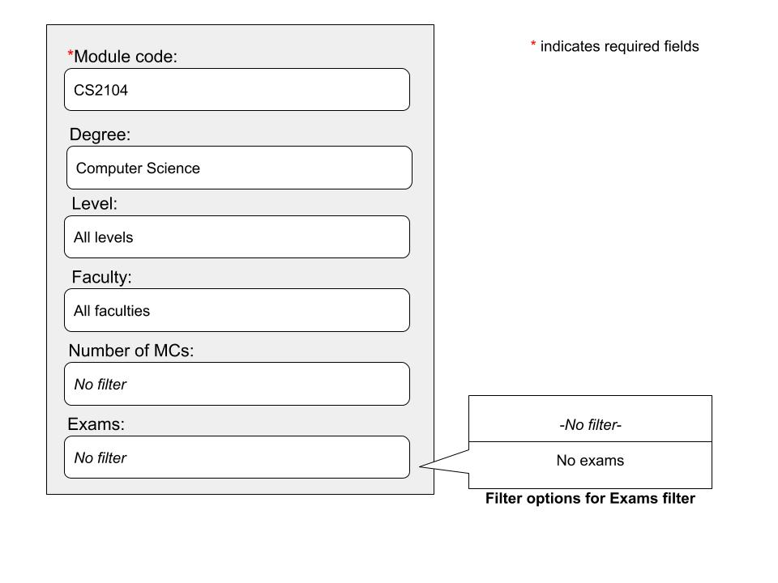
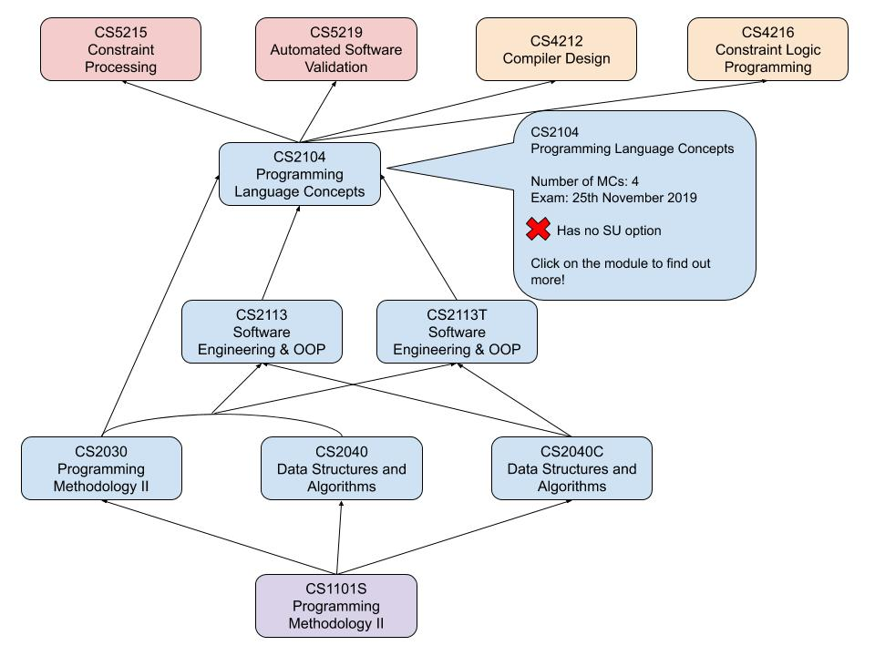

## Motivation

When you are fresh out of tertiary education, researching and considering prospective courses to apply for in university can be a daunting task. While many of us have a rough idea of what the course entails and the job opportunities it brings, many are still **uncertain** of whether their choice is a right fit for them. Furthermore, it is not always clear **what to expect** from your course.

With a plethora of modules available for prospective students, many will find it **confusing** and **complex** to get a full picture of what to expect and learn in their course of choice. This problem extends to current undergraduates as well. Many current undergraduates may be **unsure** of how to **plan** which modules to take to ensure that they will graduate on schedule. They may also find it difficult to source for information on **specific modules** required to achieve their desired specialization.

We believe such problems arise due to a lack of a visualization tool which can help students have a better way to conceptualize how each module is related to each other. Thus, we would like to create one for the benefit of current and prospective students.

## Aim

We want to provide a tool to help current and prospective students plan their track in academia by providing clarity and insight through visualizing their university course pathway.

## User Stories

1. As a student who is deciding on which course to choose in university, I want to see what skills and abilities I will be able to gain by looking at a mapping of the modules I will complete in the future.

2. As a student who is deciding on how to plan my modules based on the area I wish to specialize in, I want to be able to quickly see all the prerequisite modules and what they will eventually map to.

3. As a student, I am confused by all the information posted online in text. I want a visual aid to help me see which modules I have to take in order to obtain my degree and fulfill any specialization requirements.

4. As a student, I want help and suggestions from teachers or seniors on which modules I should be taking in my current semester or in the next semester to graduate with the specialization I want.

5. As a student, I would like to be able to jump quickly to information about related modules in the specialization I am interested in.

## Scope of Project

**Modulari** provides a web-based graphical user interface for students to generate graphs to help students better able to visualize their university pathway.

### **Who is Modulari intended for?**

1. Prospective NUS students
    - Will be able to better visualize what their years of studying in NUS will be like (e.g what modules they will be taking)
    - Will be able to gain a better understanding of what to expect in their specified course/degree
2. Current NUS students
    - Will be able to better plan what modules to take to graduate smoothly
    - Will be able to better plan modules to achieve their specialization of choice

### **Features**

The **Module Map Generator** generates and draws a module dependency graph (i.e. a node will link to its prerequisites)

The **Module Description** will provide the basic module outline as well as a platform for prospective students to clarify doubts.

The **Forum/Q&A page** allows students to clarify their doubts and engage in discourse. 

The **User Login System** allows current NUS students to use their NUSNET accounts to find their saved graphs/tables easily.

The **Possible Pathway** generates a table showing recommended modules to take for each semester.

A **Progress bar** allows current NUS students to keep track of their progress in completing their course which can be accessed when logged into their NUSNET accounts.

## Proposed Core Features

### Features to be completed by mid-June:

1. **Module Map Generator**
    - Represented as a directed-acyclic graph
        1. Each node represents a module with its respective module code and name and is colour-coded based on the level of the module
        2. Each node can be expanded to view its module description when the cursor is hovered over the node
        3. Modules which are a prerequisite of another module are connected by an edge 
    - Users will be able to view a graphical overview of all the core modules in the specified course
    - Users will be able to view the prerequisite tree of specific modules
        1. Prerequisite tree can be modified to match user's preferred filters via the user interface

2. **Module Description**
    - General information of the modules will be included
        1. Module code
        2. Name of module
        3. Number of module credits
        4. Information whether there is a final exam
        5. Information about SU option
    - If students want to find out more about the module or the experiences of students who took the module, they will be able to click on the module and be redirected to the respective NUSMods page to view reviews and tips posted by seniors who have completed it

**Example of user interface to generate prerequisite tree below found below**

**Prerequisite tree for CS2104**

### Features to be completed by mid-July:

1. **Forum page**
    - A platform for prospective students to clarify doubts about their desired course
    - Current NUS students will be able to pose questions on modules that they may be unsure of taking which may be answered by other students or the professors conducting the modules that semester
2. **User Login System (for current NUS students)**
    - Current NUS students can log in using their NUSNET accounts to access saved previously generated module maps to be viewed quickly in the future
        1. User-generated maps saved can be downloaded by exporting to pdf 
3. **Possible Pathway (for current NUS students)**
    - Shows a recommendation of modules to be taken in each semester
    - Recommendations to be tailored according to specialisation listed
    - Allow users to save previously generated tables
